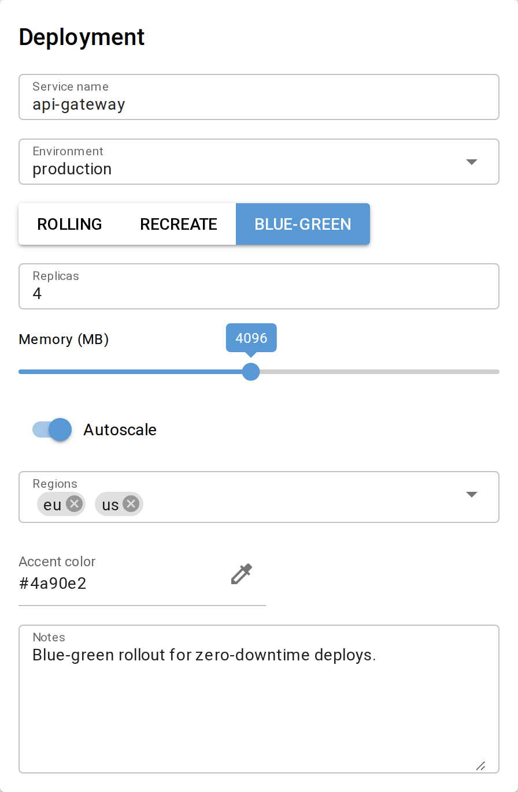
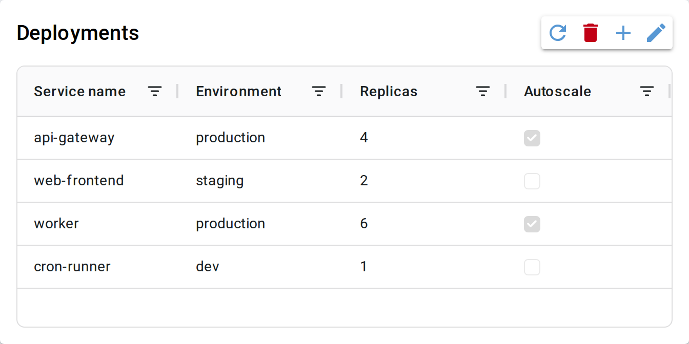
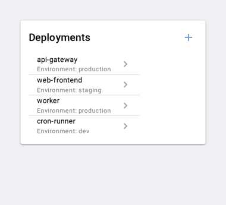

NiceView
========

[](https://github.com/clausgf/niceview/actions/workflows/ci.yml)

NiceView simplifies [NiceGUI](https://nicegui.io) programming by deriving forms and tables from Pydantic models. Inspired by [MagicGUI](https://magicgui.readthedocs.io/), [NiceCRUD](https://github.com/zauberzeug/nicegui/tree/main/examples/nicecrud) and [Django](https://docs.djangoproject.com/)'s admin integration.

<p align="center">
  <br>
  <sub>One <code>ModelForm.from_item(...)</code> call, rendered from a Pydantic model.</sub>
</p>


Installation
------------

```bash
uv add git+https://github.com/clausgf/niceview          # or: pip install git+https://...
uv add "niceview[sqlmodel] @ git+https://github.com/clausgf/niceview"   # with SqlModelAdapter
```

`SqlModelAdapter` is the only component with an extra dependency (`sqlmodel`); everything else
works with the base install. All public names are importable directly from `niceview`
(`from niceview import ModelForm, ModelGrid, ...`).


Quick Start
-----------

```python
import pydantic
from nicegui import ui
from niceview import ModelForm

class User(pydantic.BaseModel):
    name: str = pydantic.Field(default='', max_length=50, title='Name')
    age: int = pydantic.Field(default=0, ge=0, le=150)
    active: bool = True

user = User(name='Alice', age=30)

@ui.page('/')
def main():
    form = ModelForm.from_item(user)
    form.render()

ui.run()
```


API Design
----------

NiceView follows a consistent factory pattern across all backends and UI components:

| | **ModelForm** (single item, fields only) | **EditFormWrapper** (single item + chrome) | **ModelGrid / ModelGridInlineEdit** (list) |
|---|---|---|---|
| **In-memory** | `ModelForm.from_item(Type, instance)` | `EditFormWrapper.from_item(Type, instance)` | `ModelGrid.from_list(Type, items)`<br>`EditGridWrapper.from_list(Type, items)` |
| **JSON file** | `ModelForm.from_json(Type, path, lock_field=, created_field=)` | `EditFormWrapper.from_json(Type, path, lock_field=, created_field=)` | `ModelGrid.from_json(Type, path)`<br>`EditGridWrapper.from_json(Type, path)` |
| **Any adapter** | `ModelForm.from_adapter(Type, adapter, key?)` | `EditFormWrapper.from_adapter(Type, adapter, key?)` | `ModelGrid.from_adapter(Type, adapter)`<br>`EditGridWrapper.from_adapter(Type, adapter)` |

All `from_*` methods accept the same keyword options; unknown keyword arguments raise `TypeError`
instead of being silently ignored. All components follow the same create-then-render pattern: the
factory returns the instance, `render()` draws it into the current NiceGUI context and returns the
instance again, so the fluent one-liner `X.from_list(...).render()` always works.

**Data adapters** are the abstraction layer between UI components and storage backends.
The `from_*` convenience methods create and hide the adapter; pass an adapter explicitly
for full control or when using SQL / custom backends.


Components at a glance
----------------------

| Component | Purpose |
|---|---|
| [`ModelForm`](docs/components.md#modelform) | A Pydantic model as an editable form (fields only, no chrome) |
| [`ModelGrid` / `ModelGridInlineEdit`](docs/components.md#modelgrid--modelgridinlineedit) | A list as a read-only or inline-editable AgGrid table |
| [`EditGridWrapper` / `EditFormWrapper`](docs/components.md#editgridwrapper--editformwrapper) | Grid/form plus title, description and CRUD/action buttons |
| [Card-based list editing](docs/components.md#card-based-list-editing) | One autosaving `ModelForm` per item, custom layout |
| [`ModelList` / `DrillDownWrapper`](docs/components.md#modellist--drilldownwrapper) | Mobile-first list ↔ detail drill-down navigation |


Screenshots
-----------

<table>
  <tr>
    <td align="center" valign="top">
      <br>
      <sub><b>EditGridWrapper</b> — table with add / edit / delete / refresh</sub>
    </td>
    <td align="center" valign="top">
      <br>
      <sub><b>DrillDownWrapper</b> — mobile list ↔ detail drill-down</sub>
    </td>
  </tr>
</table>

(Screenshots are regenerated with `docs/screenshots/capture.py` — see [docs/img/README.md](docs/img/README.md).)


Documentation
-------------

- **[Components](docs/components.md)** — `ModelForm`, `ModelGrid`, the edit wrappers, card lists, and `ModelList`/`DrillDownWrapper`
- **[Data Adapters](docs/adapters.md)** — storage backends, lenient loading, optimistic locking, reactive updates, adapter protocols
- **[Field Types & Customization](docs/field-types.md)** — type→widget mapping, `niceview.Field()` options, `Meta` profiles, validation
- **[Dialogs](docs/dialogs.md)** — `confirm_dialog`, `input_dialog`, `submit_dialog`
- **[DESIGN.md](DESIGN.md)** — design decisions and accepted technical debt
- **[TODO.md](TODO.md)** — open questions and planned work
- **[Changelog](docs/CHANGELOG.md)** · License: **[MIT](LICENSE)**


Development
-----------

Install dependencies and run the checks:
```bash
uv sync --dev
uv run pytest
uv run mypy niceview/ --ignore-missing-imports
uv run ruff check
```

Run examples (after `uv sync --dev`, which editable-installs `niceview` into `.venv`):
```bash
uv run python examples/01_form_basic.py
```

In **VS Code**, open the folder and pick the `.venv` interpreter (auto-detected; a
`.vscode/` config is included). Then just press the ▶ **Run** button — or **F5** — with any
example open; no `sys.path` setup is needed because `niceview` is installed into the venv.

| Example | Topic |
|---|---|
| `01_form_basic.py` | `ModelForm` — basic usage |
| `02_field_types.py` | `ModelForm` — all supported field types |
| `03_form_binding.py` | `ModelForm` — NiceGUI binding |
| `04_form_json.py` | `ModelForm` — JSON persistence |
| `05_grid.py` | `ModelGrid` |
| `06_edit_wrapper.py` | `EditGridWrapper` / `EditFormWrapper` |
| `07_sqlmodel.py` | `SqlModelAdapter` — SQL-backed grid/form, relationships, optimistic locking |
| `08_reactive_grid.py` | Reactive grid — auto-update via `ObservableList` |
| `09_drilldown.py` | `DrillDownWrapper` / `ModelList` — embeddable list ↔ detail navigation |
| `10_complex_form_navigation.py` | `ModelForm` in a responsive split-panel: side panel on desktop, full page on mobile |
| `11_tree_navigation.py` | Multi-level tree navigation — URL factory, `FilteredAdapter`, `Meta.profiles` |
| `12_card_list.py` | Card-based list editing — autosaving `ModelForm` per item, `@model_validator`, `confirm_dialog` |
| `13_directory_drilldown.py` | `DrillDownWrapper` over `DirectoryAdapter` — one file per item, rename via a "Name" field |

Unit tests cover data adapters, field resolution, validation logic, and pure CRUD operations.
Acceptance tests use the NiceGUI `User` fixture (headless, no browser) to verify render output and
widget↔model interaction. AgGrid cell content is JS-rendered and not inspectable via the `User`
fixture; row data is covered by unit tests instead.

Contributions are welcome — see [CONTRIBUTING.md](CONTRIBUTING.md).
